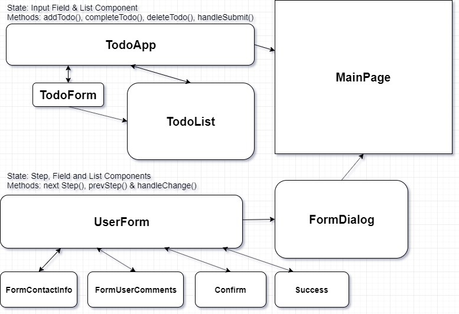

# Project 3: Task Management Web App

**Name:  Ryan Stroemel**  
**Contact: rstroemel@gmail.com**  
## Abstract:  
The purpose of this project is to code the frontend of a task management app.

## Workflow Requirements

### User Stories:

**1.** "I study at university. My schedule is hectic and I need to keep track of it. This app changed my life."  
*- Smeagul*

**2.** "I use both mobile and web apps. This task management app provides me a schedule I can keep track of!"  
*- Margaret*

**3.** "I only use mobile apps and this app keeps track of my workout schedule."  
*- Laila*

### Wireframes:

**1.** Todo List: [Wireframe](https://codesandbox.io/s/react-todo-list-use-state-bewkb)

**2.** Contact Form: [Wireframe](https://codesandbox.io/s/multi-step-contact-form-0n53k)

**3.** Todo List App: [Wireframe](https://codesandbox.io/s/todoapp1-edit-59g2z)

---
### State and Component Planning

### Development Phase:

**1.** Created GitHub repository [https://github.com/ryandude97/project-3](https://github.com/ryandude97/project-3).

**2.** Added [create-react-app](https://github.com/facebook/create-react-app), [material-ui](https://material-ui.com/) and [gh-pages](https://www.npmjs.com/package/gh-pages) to the project via npm.

**3.** Deployed production build to [GiHub Pages](https://pages.github.com/) at url: [https://ryandude97.github.io/reactapp/](https://ryandude97.github.io/reactapp/) via [gh-pages](https://www.npmjs.com/package/gh-pages) by following the process in this [video](https://youtu.be/517npPWIb8Q). The production site is hosted on the gh-pages branch of the repository [https://github.com/ryandude97/project-3/tree/gh-pages](https://github.com/ryandude97/project-3/tree/gh-pages).

**4.** Created Todo list code on [Code Sandbox](https://codesandbox.io/s/todolistapp-29m9s) by following tutorials on [YouTube](https://youtu.be/mxK8b99iJTg), [Scotch.io](https://scotch.io/tutorials/build-a-react-to-do-app-with-react-hooks-no-class-components) and [freeCodeCamp](https://www.freecodecamp.org/news/how-to-build-a-todo-list-with-react-hooks-ebaa4e3db3b/) focusing on the [React useState Hook](https://reactjs.org/docs/hooks-state.html). 

**5.** Added [Material-UI components](https://material-ui.com/getting-started/supported-components/) to the project and updated the code on [CodeSandbox](https://codesandbox.io/s/react-todo-list-use-state-bewkb).

**6.** Added a contact form to the project by following a [tutorial](https://youtu.be/zT62eVxShsY) video on Youtbe.

**7.** Updated the [conctact form code](https://codesandbox.io/s/multi-step-contact-form-0n53k) and integrated the multistep form into a [Material-UI Dialog](https://material-ui.com/components/dialogs/) component.

**8.** Integrated the Todo List and Contact form into a [Material-UI responsive layout](https://codesandbox.io/s/7xdjq).

**9.** Updated the production build on GitHub through a combination of frequent commits to the main repository and using the [npm run deploy](https://create-react-app.dev/docs/deployment) command, via gh-pages, on the gh-pages branch.

---
### Results:

#### Project URL: [https://github.com/ryandude97/project-3](https://github.com/ryandude97/project-3)

---

#### Desktop View:

  
#### Mobile View:
  
---

#### Future Improvements:

**1.** I want to loop in a back end server. 

**2.** I would like to chnage the css of the page more and play with the framework of the app more. 

**3.** I would like to change the delete function.

